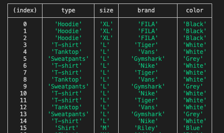

# Challenge SBAB

## What will i need to get this to work?
* npm and nodejs installed
* run 'npm start' in bash or whatever command-line interface shell you prefer.

## What does the program do?
* Reads in given files from following formats: json, xml and csv.
* Prints out a table sorted on size.

